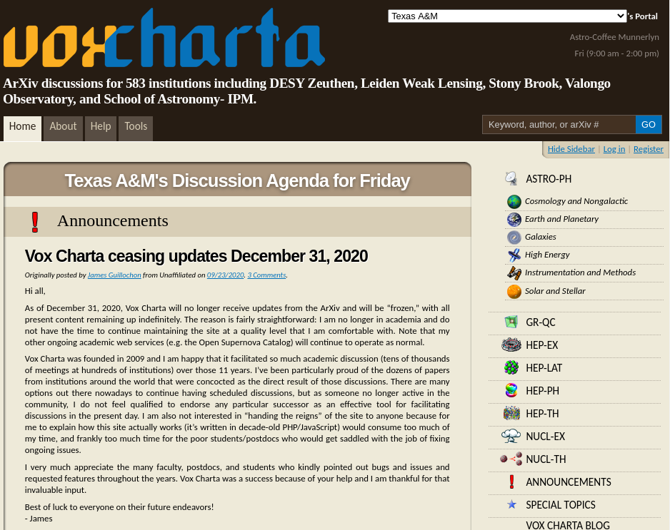

# arXiv-order
Some code I'm writing to pursue a theory about arXiv.

General Notes
-----------
* In `access_VoxCharta.py`, added a `try...except` that flags when there is no search result returned for an arXiv number... because an alarming number of these recent posts don't seem to appear on VoxCharta search results (but I can find them using the calendar).  Also past posts (e.g., 2017 papers) -- different search method needed?
* Don't use arxiv.org for the data harvesting -- use their copy site, export.arxiv.org (or you'll eventually get denied access to arXiv because you're hogging the resources)
* VoxCharta will freeze (no more daily postings from arXiv) on 31 December 2020
* VoxCharta started *around* 2009?
* when did Benty-Fields start?

Future plans
-----------
* Need to think of a way to automate this process (get it to run daily?)
* In `access_VoxCharta.py`, need to add a `try...except` that flags when there is no search result returned for an arXiv number... because an alarming number of these recent posts don't seem to appear on VoxCharta.
* Track number of votes from different institutions?  
  
  
**Notes to get things to run:**
* Make sure that your `geckodriver` executable and Firefox application are both up to date
* Make sure they they are also matching 64 bit or 32 bit (whatever is necessary for your computer)
* Add the `geckodriver` executable location to your `$PATH` OR place it in `/usr/local/bin`
* If that doesn't work, also place a copy of it in your `/usr/bin/`

## NOTE: VoxCharta will no longer pull arXiv postings on 31 December 2020

